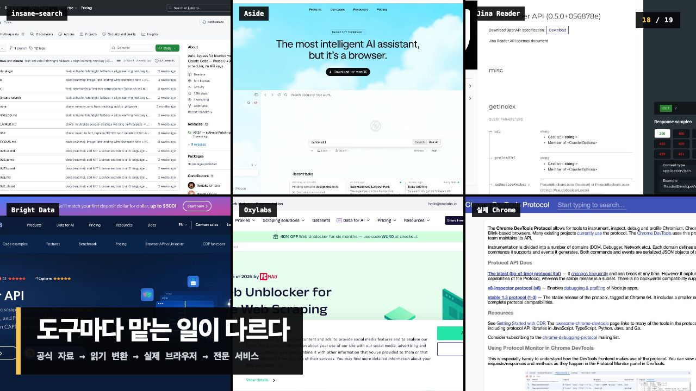

# 웹과 크롤링, 처음부터 — 19장 초보자판

실제 화면 캡처를 중심으로 다시 만든 독립형 HTML 강의입니다. `index.html` 하나만 열면 인터넷 연결 없이 발표할 수 있습니다.

- 이동: `←` `→` 또는 화면 클릭
- 발표자 대본: `N`
- 출처: `S`
- 전체 화면: `F`
- 전체 대본: `speaker-notes.md`

슬라이드의 문장은 짧게 두고, 설명과 사실관계 보충은 발표자 대본에 넣었습니다. 공개 웹 서비스 화면은 실제 캡처이며, 기초 개념 실습 화면은 강의용 로컬 데모 재연입니다.
